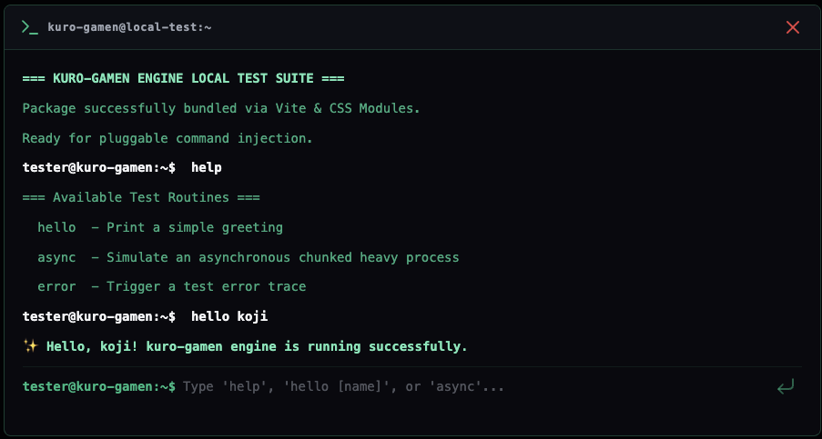

# hakoniwa-term (箱庭-term)

> Async Generator と CSS Modules による完全なスタイル分離を備えた、React アプリケーション向けのプログラマブルなレトロ・ハッカースタイル ターミナル UI エンジン。

[English](README.md) | [日本語](README_JP.md)

[](https://www.npmjs.com/package/hakoniwa-term)
[](LICENSE)

---

## 🪴 箱庭（Hakoniwa）とは？

> 日本語の **「箱庭（はこにわ / hakoniwa）」** は、文字通り「箱の中の庭」を意味します。  
> 木箱や浅いトレイの中にミニチュアの石、植物、建造物などを配置し、外から眺めて楽しめる小さな世界を作り出す伝統的な造形を指します。

`hakoniwa-term` は、その「箱の中に凝縮された自律的な小世界」というコンセプトを React ターミナル UI として再現しています。

---

## 📷 スクリーンショット & デモ



- **CodeSandbox ライブデモ**: [CodeSandbox で試す](https://codesandbox.io/p/sandbox/my9kn2)

---

## ✨ 特長

- ⚡ **Async Generator によるコマンド処理**: `async function*` の `yield` 構文を使用して、ログのストリーミング出力やリアルタイムプログレスバーの更新を直感的に実装可能です。
- 🎨 **レトロハッカースタイル**: 伝統的な CLI 環境を意識したダークテーマデザイン。
- 🔒 **スタイル分離**: CSS Modules で構築されているため、親アプリや外部のグローバルスタイルへ影響を与えません。
- ⏳ **ビルトインプログレスバー**: コマンド実行中、`%` 表記の進捗バーをジェネレーターから直接リアルタイム更新できます。
- 🔐 **システムロック機能**: コマンド実行中は入力フィールドをロックし、競合状態や二重送信を防ぎます。
- 🧹 **ビルトインユーティリティ**: `clear` コマンドによる履歴クリアを標準サポート。
- 📘 **TypeScript 完全対応**: Props、ログ、Yield 形式、コマンドハンドラーまで型安全です。

---

## 📦 インストール

お使いのパッケージマネージャーで `hakoniwa-term` をインストールしてください:

```bash
npm install hakoniwa-term lucide-react
# または
pnpm add hakoniwa-term lucide-react
# または
yarn add hakoniwa-term lucide-react
```

> **注意**: ターミナル内のアイコン描画のために `lucide-react` が必要です。また、`react` および `react-dom` (>= 18.0.0) が peerDependencies に指定されています。

---

## 🚀 クイックスタート

1. `Terminal` コンポーネントをインポートします。
2. 同梱されている CSS スタイルシート (`hakoniwa-term/dist/index.css`) をインポートします。
3. Async Generator 関数としてコマンドマップを定義します。

```tsx
import React from 'react';
import { Terminal, CommandAction } from 'hakoniwa-term';
import 'hakoniwa-term/dist/index.css';

export default function App() {
  const commands: Record<string, CommandAction> = {
    // 挨拶コマンド
    hello: async function* (args) {
      const name = args[1] || 'Guest';
      yield {
        type: 'log',
        log: { type: 'success', text: `✨ ようこそ、${name} さん！` },
      };
    },

    // システム情報コマンド
    system: async function* () {
      yield {
        type: 'log',
        log: { type: 'output', text: 'System status: Operational' },
      };
      yield {
        type: 'log',
        log: { type: 'output', text: 'Kernel: hakoniwa-v0.0.3' },
      };
    },
  };

  return (
    <div style={{ padding: '2rem', height: '100vh', background: '#020204' }}>
      <Terminal
        title="guest@hakoniwa:~"
        promptString="user@hakoniwa:~$ "
        placeholder="コマンドを入力 ('hello [名前]' や 'system')..."
        commands={commands}
      />
    </div>
  );
}
```

---

## 💡 高度な使い方: ログストリーミングとプログレスバー

`hakoniwa-term` のコマンドは JavaScript の **Async Generator** (`async function*`) を利用します。これにより、時間のかかる非同期処理や複数ステップのタスクにおいて、ログメッセージの逐次出力やプログレスバーの更新をシームレスに行えます。

### 例: プログレスバー付きのマルチステップ非同期コマンド

```tsx
import { Terminal, CommandAction } from 'hakoniwa-term';
import 'hakoniwa-term/dist/index.css';

const delay = (ms: number) => new Promise((resolve) => setTimeout(resolve, ms));

const commands: Record<string, CommandAction> = {
  sync: async function* () {
    // 1. ログ出力
    yield {
      type: 'log',
      log: { type: 'output', text: 'リモートリポジトリに接続中...' },
    };

    // 2. プログレス更新 (20%)
    await delay(500);
    yield { type: 'progress', percent: 20, text: 'リモート参照を取得中...' };

    // 3. プログレス更新 (65%)
    await delay(500);
    yield { type: 'progress', percent: 65, text: 'オブジェクトを展開中...' };

    // 4. プログレス更新 (100%)
    await delay(500);
    yield { type: 'progress', percent: 100, text: '同期処理を完了中...' };

    // 5. 最終成功ログを出力
    yield {
      type: 'log',
      log: { type: 'success', text: '✨ リポジトリの同期が正常に完了しました！' },
    };
  },

  errorTest: async function* () {
    yield {
      type: 'log',
      log: { type: 'error', text: '❌ エラー: 不正なアクセスが検出されました！' },
    };
  },
};
```

---

## 🎛️ コンポーネント API (`TerminalProps`)

| Prop | 型 | 初期値 | 説明 |
| :--- | :--- | :--- | :--- |
| `commands` | `Record<string, CommandAction>` | **必須** | コマンド名と Async Generator ハンドラーのマッピング。 |
| `promptString` | `string` | `'user@terminal:~$'` | 入力フィールドの前に表示されるプロンプト文字列。 |
| `placeholder` | `string` | `'Type a command...'` | 入力ボックスのプレースホルダーテキスト。 |
| `systemLockedText` | `string` | `'System locked during execution...'` | コマンド実行中に表示される入力ボックスのロック時テキスト。 |
| `title` | `React.ReactNode` | `'terminal'` | ウィンドウヘッダーのタイトル（文字列またはカスタムコンポーネント）。 |
| `initialHistory` | `CommandLog[]` | `[]` | マウント時に初期表示するログの配列。 |
| `showCloseButton` | `boolean` | `true` | ヘッダー右上の閉じるボタン (`X`) を表示するかどうか。 |
| `onClose` | `() => void` | `undefined` | 閉じるボタンがクリックされた時のコールバック。 |
| `headerRightActions` | `React.ReactNode` | `undefined` | ヘッダー右側に配置するカスタム React ノード。 |
| `commandNotFoundFormatter` | `(cmd: string) => string` | `(cmd) => Command not found: "${cmd}".` | 未定義コマンドが入力された時のエラーメッセージ生成関数。 |

---

## 📐 TypeScript 型定義

```typescript
export interface CommandLog {
  type: 'input' | 'output' | 'error' | 'success';
  text: string;
}

export type YieldChunk =
  | { type: 'log'; log: CommandLog }
  | { type: 'progress'; percent: number; text?: string };

export type CommandAction = (args: string[]) => AsyncGenerator<YieldChunk, void, unknown>;
```

---

## 📜 ライセンス

[MIT](LICENSE) © [koji](https://github.com/koji)
